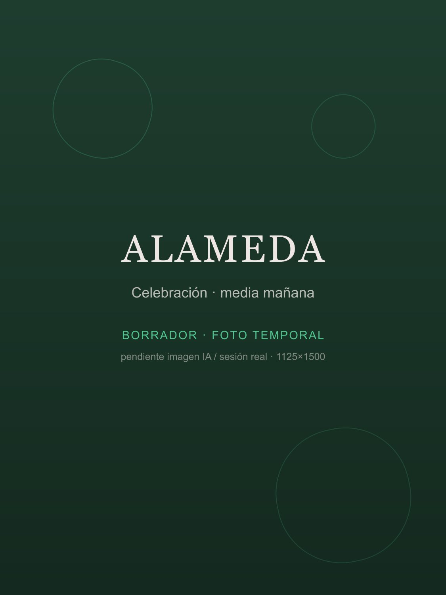
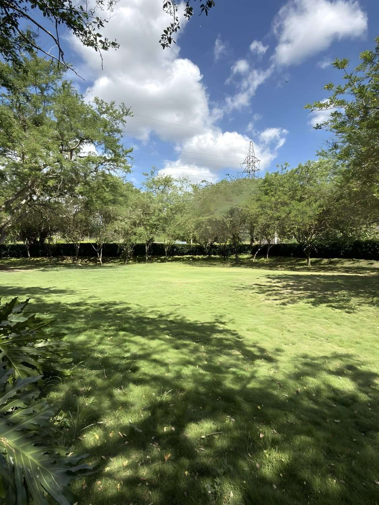

# Plan de diseño (animación) y fotos temporales con IA

**Estado: EJECUTADO EN LOS FRAGMENTOS · PENDIENTE DE ENSAMBLAR Y PUBLICAR.**

El documento nació como auditoría de solo lectura (`web-design-master` +
estudio de fotos faltantes). Con la orden explícita del cliente se ejecutó
después sobre `sections/*.html`, `styles/sections/*.css` y `js/`:

| | Estado |
|---|---|
| Parte 1 · 1. Curaduría del muro de aves (9 destacadas + archivo de 48) | hecho |
| Parte 1 · 2. Foto-focus ligado al scroll (`js/foto-focus.js`, nosotros + espacios) | hecho |
| Parte 1 · 3. Mariposa restringida a los CTA de conversión | hecho |
| Parte 1 · 4. Pieza-cifra dominante «101» (`.nat-cifra-dominante`) | hecho |
| Parte 1 · 5. Partículas del hero (`js/particulas-hero.js`) | hecho |
| Parte 2 · Integración de las 8 fotos `-TEMP` | hecho |
| **Ensamblar, versionar y publicar** | **PENDIENTE — requiere orden explícita** |

**La tarea pendiente, literal.** `index.html` todavía es el de la versión
anterior: el rediseño vive sólo en los fragmentos. Mientras no se ensamble,
`node herramientas/validar.js` da un veredicto sobre la página VIEJA y no
sobre este trabajo, y `js/foto-focus.js`, `js/particulas-hero.js` y las ocho
fotos `-TEMP` son archivos que nadie carga. Cuando el cliente dé la orden en
ese mismo mensaje, y en este orden:

```
node herramientas/ensamblar.js
node herramientas/versionar-assets.js --escribir
node herramientas/validar.js
```

Hasta entonces no se toca. Ver la regla dura de `CLAUDE.md`: ningún archivo
del sitio se toca —ni se ensambla, ni se comitea, ni se publica— sin
autorización dada en el mismo mensaje que pide la ejecución.

Mientras conviva el `index.html` viejo con las hojas nuevas, dos reglas
puente lo sostienen y **se retiran cuando el ensamblador vuelva a correr**:
`.nat-titulo-cifra` en `styles/sections/naturaleza.css` (impide que el
contador del 101 recomponga el titular en cada fotograma) y
`.espacio__img--apoyo` en `styles/sections/espacios.css`.

---

## PARTE 1 — Plan de animación y diseño (para ejecutar más adelante)

Fuente: auditoría de `web-design-master` sobre el estado actual del sitio,
comparado contra `PROYECTO RAFAEL SILVA` (referencia de animación de la casa).
El sistema de tokens/paleta/tipografía de Vegas del Verde **no se toca** —
el diagnóstico no es de sistema, es de foco: sobran gestos decorativos
dispersos y falta una pieza que ancle la mirada.

### Orden de ejecución propuesto

1. **Curar el grid de aves** (`sections/naturaleza.html`, banco de 57 fotos
   en `img/aves/`)
   Separar 8–10 fotos de mejor calidad/composición en formato grande
   (pieza dominante), el resto (~41) en mosaico compacto. Hoy las 57 llevan
   el mismo tratamiento de celda/sombra/radio sin distinguir calidad —eso
   nivela el sitio entero hacia abajo—. Criterio de selección: nitidez,
   composición, especie con mejor pose/luz — no diversidad de especie por
   sí sola. Cambio de maquetación, no de contenido. Impacto alto, costo bajo.

2. **Foto-focus ligado al scroll** en `nosotros` y `espacios`
   Patrón ya validado en 3 sitios de la casa (Felipe, y portado en Rafael):
   la foto se encuadra/hace zoom según el progreso de scroll de su sección.
   Desktop: `scale`. Móvil: `object-position`. GPU-only, sin animar
   layout. Hoy Vegas no tiene ningún efecto de foto ligado a scroll —
   todas sus fotos están estáticas salvo el mapa.

3. **Restringir la mariposa-al-clic** (`js/app.js:101` aprox.)
   Hoy dispara en cualquier clic del sitio entero, lo que la banaliza con
   el uso. Limitarla a CTAs de conversión (botones de WhatsApp, "Quiero
   este plan", "Reserva tu escape", etc.), no en navegación general.

4. **Una pieza-cifra dominante**
   Elegir LA cifra más fuerte del predio (candidatas: 101 especies de
   aves, 4 hectáreas, años operando) y darle tratamiento de componente
   visual propio — grande, con su propia composición — en vez de vivir
   dentro de una fila más de contador junto a otras cifras. Ya existe el
   motor de contador animado en `js/app.js` (línea ~245-273): se reutiliza
   el mecanismo, cambia el tratamiento visual de UNA cifra elegida.

5. **Canvas de partículas ambientales sobre el hero** (la más cara, al final)
   Inspirado en la lluvia de canvas de Rafael (`PROYECTO RAFAEL SILVA/sitio/lluvia.js`):
   partículas de aire/polen/hojas cayendo, coordenadas a una zona real de
   la foto del hero (el follaje), import dinámico post-decode,
   IntersectionObserver + `visibilitychange`, no se monta con
   `prefers-reduced-motion`. Evaluar DESPUÉS de ver el efecto de los
   puntos 1–4: es la apuesta de mayor esfuerzo y depende de que el resto
   ya se sienta resuelto.

### Qué NO se toca

- `styles/tokens.css`, la paleta, la tipografía — ya están al nivel de la casa.
- `sections/naturaleza.html` no lleva personas (ver Parte 2): esa sección
  tiene prohibido por su propio contrato mezclar el argumento de
  biodiversidad con actividad humana.
- El hero actual (composición aérea + plano-índice) no se reemplaza — se
  le añade movimiento (punto 5), no se rediseña de cero.

### Referencia técnica (para quien ejecute)

Comparación completa con ejemplos de código en el informe de auditoría
(sesión donde se generó este documento). Archivos citados como referencia:
`PROYECTO RAFAEL SILVA/sitio/lluvia.js`, `estilo.css`, `app.js`.

---

## PARTE 2 — Fotos temporales con IA (para reemplazar por fotos reales después)

**Por qué son temporales:** sirven para probar si "espacio ocupado" vende
mejor que "espacio vacío" antes de invertir en una sesión fotográfica real
en el predio. Ninguna se presenta como foto real del lugar — llevan sufijo
`-TEMP` en el nombre de archivo y el atributo `data-pendiente-foto` en la
etiqueta. Se reemplazan 1:1 por la foto real del predio en cuanto exista,
sin más cambios de código que la ruta y quitar ese atributo.

**Convención de reemplazo (única, la que está implementada):**
```html
<!-- mientras es temporal -->

<!-- cuando llegue la foto real, sólo cambia esto: -->

```

**Por qué el marcador NO va dentro del `alt`.** El `alt` es lo único que oye
quien navega con lector de pantalla: meterle «[BORRADOR — pendiente…]»
delante le lee una nota editorial en ocho puntos de la página y no le
describe mejor la foto. El marcador es información para el equipo, no para
el visitante, así que vive en un atributo propio —que se encuentra con un
`grep data-pendiente-foto`, igual de rápido— y el `alt` describe exactamente
la imagen que se está sirviendo. La descripción no cambia al llegar la foto
real: la escena es la misma; lo que cambia es de dónde salió.

No se genera ninguna imagen en esta sesión (no hay herramienta de
generación fotorrealista conectada). Los prompts de abajo están listos
para pegar en ChatGPT/Midjourney/lo que se use; el resultado se trae de
vuelta para integrarlo.

### 1. Espacios — prioridad 1 (hoy se muestran vacíos), los 5 escenarios completos

| Archivo temporal | Reemplaza en | Medidas exactas |
|---|---|---|
| `img/espacios/alameda-1-TEMP.jpg` | Alameda (150 personas) | 1125×1500 (vertical 3:4) |
| `img/parque/parque-47-TEMP.jpg` | La Vega (100 personas) | 675×1200 (vertical angosta) |
| `img/parque/parque-56-TEMP.jpg` | Teatrino (70 personas) | 675×1200 (vertical angosta) |
| `img/espacios/taller-1-TEMP.jpg` | Taller (45 personas) | 849×1500 (vertical angosta) |
| `img/parque/parque-57-TEMP.jpg` | Cancha (30+20) | 900×1200 (vertical 3:4) |

Las cinco escenas están escritas para que **no se vean clonadas entre sí**
— distinta ocasión, distinta hora del día, distinta composición — que es
justo lo que la auditoría pidió evitar (bloques repetidos con el mismo
tratamiento).

**Prompt — Alameda** (celebración social, media mañana):
> Fotografía documental, luz natural de media mañana, gran angular ligero.
> Prado abierto bajo árboles altos de copa amplia en un bosque tropical de
> montaña colombiano. Un grupo pequeño de 6-8 personas adultas colombianas
> diversas en edad, vestidas casual-elegante (colores neutros y tierra, sin
> logos), de pie y conversando en corrillos sobre el césped, algunas con
> copas de vino, ambiente de celebración discreta al aire libre — NO boda
> formal, NO carpa, NO decoración de evento. Cámara a la altura de los ojos,
> foco nítido en el grupo, fondo con leve profundidad de campo. Composición
> vertical 3:4. Estilo: fotografía editorial de turismo rural, natural, sin
> sobre-saturación, sin gente mirando a cámara ni posando.

**Prompt — La Vega** (encuentro corporativo/familiar, mediodía):
> Fotografía documental, luz de mediodía uniforme, prado amplio y despejado
> rodeado de vegetación tropical alta al fondo. Un grupo de 10-12 adultos
> colombianos en ropa casual de oficina (sin uniformes corporativos ni
> logos), sentados en círculo sobre mantas y sillas plegables bajo la
> sombra parcial de un árbol grande, algunos con vasos o platos, ambiente
> de integración de equipo o reunión familiar al aire libre — relajado, sin
> pancartas ni banners. Composición vertical angosta 675:1200. Foco medio
> en el grupo, profundidad de campo suave hacia el fondo verde.

**Prompt — Teatrino** (función/presentación, atardecer):
> Fotografía documental, luz cálida de atardecer, un pequeño anfiteatro
> natural al aire libre — gradas simples de madera o el propio desnivel del
> terreno como asientos, árboles altos enmarcando un "escenario" de césped.
> Público de 15-20 personas de edades mixtas sentado mirando hacia el frente
> (de espaldas o perfil a la cámara, no mirando al lente), una figura de pie
> al frente en silueta suave como si presentara algo — sin instrumentos ni
> vestuario que insinúen un acto específico. Composición vertical angosta
> 675:1200, cámara desde atrás del público. Tonos dorados de atardecer.

**Prompt — Taller** (interior techado, luz de mañana):
> Fotografía documental, interior con luz natural entrando por los
> laterales abiertos, estructura de madera y techo artesanal tipo palapa.
> 8-10 personas sentadas en círculo o en mesas largas, participando de un
> taller o clase (pintura, jardinería, trabajo manual) — manos visibles
> trabajando, materiales sobre la mesa, ambiente concentrado y relajado a
> la vez. Composición vertical, formato angosto 849:1500. Luz cálida, tonos
> verdes y madera. Sin texto, sin logos, sin caras mirando a cámara.

**Prompt — Cancha:**
> Fotografía documental de una cancha deportiva al aire libre rodeada de
> vegetación tropical, luz de tarde. Un grupo informal de 8-10 personas
> jóvenes-adultas jugando o a punto de jugar un partido recreativo (fútbol
> o similar), en movimiento natural, algunas personas sentadas al margen
> como espectadores en sillas plásticas. Composición vertical 3:4, cámara a
> nivel del terreno. Estilo editorial, sin uniformes de marca, sin texto.

### 2. Colegios — prioridad 2 (hoy usa fotos de parque genéricas sin niños)

| Archivo temporal | Reemplaza en | Medidas exactas |
|---|---|---|
| `img/parque/parque-32-TEMP.jpg` | Grupo escolar en el Sendero | 900×1200 |
| `img/parque/parque-34-TEMP.jpg` | Niños en observatorio de aves | 675×1200 |

**Prompt — Sendero:**
> Fotografía documental, grupo de 10-12 niños de primaria (9-11 años) con
> uniforme escolar colombiano genérico (sin logo de institución),
> caminando en fila por un sendero de tierra bajo un túnel de árboles y
> guaduas, acompañados por una profesora adulta al frente señalando algo
> entre el follaje. Luz de mañana filtrada entre hojas. Composición
> vertical 3:4. Caras no protagonistas (de espaldas o de perfil, no
> mirando a cámara) — evitar que parezca foto posada de anuario.

**Prompt — Observatorio:**
> Fotografía documental, 5-6 niños de primaria con binoculares mirando
> hacia el follaje desde una plataforma de madera simple tipo mirador,
> guía adulto señalando hacia arriba. Luz natural de bosque, tonos verdes.
> Composición vertical angosta 675:1200. Estilo espontáneo, no posado.

### 3. Vivero — prioridad 3 (hoy solo fotos de plantas, sin personas)

| Archivo temporal | Reemplaza en | Medidas exactas |
|---|---|---|
| `img/parque/parque-40-TEMP.jpg` | Persona eligiendo/cargando plantas | 675×1200 |

**Prompt:**
> Fotografía documental, una mujer adulta colombiana de mediana edad, ropa
> casual de jardín, sosteniendo una matera con una planta tropical de
> hojas grandes entre las hileras de un vivero techado con malla sombra,
> otras plantas en macetas de barro y plástico negro alrededor, luz
> natural filtrada. Composición vertical angosta 675:1200. Expresión
> natural, no sonrisa forzada a cámara, foco en la planta y las manos.

### Fuera de alcance a propósito

No se propone ninguna foto de personas para `inicio` (hero ya resuelto) ni
para `naturaleza` (prohibido por contrato mezclar personas con el
argumento de biodiversidad — ver `ARQUITECTURA-V3.md`). Tampoco se
proponen versiones con gente para `parque-19` y `parque-52` de `colegios`
(mural de aves y franja florida): son ambiente, no escenario de actividad.

### Resumen — las 8 fotos completas

| # | Archivo temporal | Sección | Medidas |
|---|---|---|---|
| 1 | `img/espacios/alameda-1-TEMP.jpg` | Espacios · Alameda | 1125×1500 |
| 2 | `img/parque/parque-47-TEMP.jpg` | Espacios · La Vega | 675×1200 |
| 3 | `img/parque/parque-56-TEMP.jpg` | Espacios · Teatrino | 675×1200 |
| 4 | `img/espacios/taller-1-TEMP.jpg` | Espacios · Taller | 849×1500 |
| 5 | `img/parque/parque-57-TEMP.jpg` | Espacios · Cancha | 900×1200 |
| 6 | `img/parque/parque-32-TEMP.jpg` | Colegios · Sendero | 900×1200 |
| 7 | `img/parque/parque-34-TEMP.jpg` | Colegios · Observatorio | 675×1200 |
| 8 | `img/parque/parque-40-TEMP.jpg` | Vivero | 675×1200 |

---

## Cómo se retoma esto

Los pasos 1 y 2 ya están cumplidos; queda el 3.

1. ~~El cliente entrega los 8 archivos generados con los nombres exactos de
   arriba (`-TEMP.jpg`), en las medidas indicadas.~~ Entregados e integrados.
2. ~~Se pide ejecución explícita de la Parte 1 (diseño/animación) y/o la
   integración de la Parte 2 (fotos), en ese mismo mensaje.~~ Ejecutadas
   ambas sobre `sections/`, `styles/sections/` y `js/`.
3. **PENDIENTE.** Con orden explícita del cliente en ese mismo mensaje: se
   ensambla con `herramientas/ensamblar.js`, se versiona con
   `herramientas/versionar-assets.js --escribir` y se valida con
   `herramientas/validar.js` — en ese orden, porque el ensamblador reescribe
   el bloque de `<link>` sin versión— antes de comitear y publicar. Sólo
   entonces el veredicto del validador es sobre esta página y no sobre la
   anterior.

### Cuando lleguen las fotos reales

Para cada una de las ocho: cambiar la ruta (quitar el sufijo `-TEMP`),
borrar el atributo `data-pendiente-foto` de esa etiqueta y dejar el `alt`
como está. `grep -rn data-pendiente-foto sections/` da la lista viva de lo
que falta; cuando no devuelva nada, la Parte 2 está cerrada.
